```python
import tifffile
#matplotlib let's us plot data
import matplotlib.pyplot as plt
#pandas handles tables
import pandas as pd
#numpy handles multidimensional data sets
import numpy as np
#scipy ndimage does image filtering and label measurement
import scipy.ndimage as ndi
```


```python
from PIL import Image
```


```python
Image.open('blobs.tif')
```


    
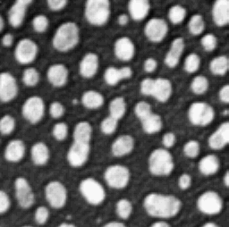
    


```python
import tifffile
```


```python
img=tifffile.imread('blobs.tif')
```


```python
img.shape
```


    (254, 256)


```python
img
```


    array([[ 40,  32,  24, ..., 216, 200, 200],
           [ 56,  40,  24, ..., 232, 216, 216],
           [ 64,  48,  24, ..., 240, 232, 232],
           ...,
           [ 72,  80,  80, ...,  48,  48,  48],
           [ 80,  80,  80, ...,  48,  48,  48],
           [ 96,  88,  80, ...,  48,  48,  48]], dtype=uint8)


```python
import numpy as np
import pandas as pd
import matplotlib.pyplot as plt
```


```python
df=pd.DataFrame(img)
df.head()
```


<div>
<style scoped>
    .dataframe tbody tr th:only-of-type {
        vertical-align: middle;
    }

    .dataframe tbody tr th {
        vertical-align: top;
    }

    .dataframe thead th {
        text-align: right;
    }
</style>
<table border="1" class="dataframe">
  <thead>
    <tr style="text-align: right;">
      <th></th>
      <th>0</th>
      <th>1</th>
      <th>2</th>
      <th>3</th>
      <th>4</th>
      <th>5</th>
      <th>6</th>
      <th>7</th>
      <th>8</th>
      <th>9</th>
      <th>...</th>
      <th>246</th>
      <th>247</th>
      <th>248</th>
      <th>249</th>
      <th>250</th>
      <th>251</th>
      <th>252</th>
      <th>253</th>
      <th>254</th>
      <th>255</th>
    </tr>
  </thead>
  <tbody>
    <tr>
      <th>0</th>
      <td>40</td>
      <td>32</td>
      <td>24</td>
      <td>24</td>
      <td>16</td>
      <td>24</td>
      <td>24</td>
      <td>32</td>
      <td>32</td>
      <td>32</td>
      <td>...</td>
      <td>232</td>
      <td>240</td>
      <td>240</td>
      <td>240</td>
      <td>240</td>
      <td>240</td>
      <td>232</td>
      <td>216</td>
      <td>200</td>
      <td>200</td>
    </tr>
    <tr>
      <th>1</th>
      <td>56</td>
      <td>40</td>
      <td>24</td>
      <td>24</td>
      <td>24</td>
      <td>32</td>
      <td>32</td>
      <td>32</td>
      <td>32</td>
      <td>32</td>
      <td>...</td>
      <td>240</td>
      <td>248</td>
      <td>248</td>
      <td>248</td>
      <td>248</td>
      <td>240</td>
      <td>240</td>
      <td>232</td>
      <td>216</td>
      <td>216</td>
    </tr>
    <tr>
      <th>2</th>
      <td>64</td>
      <td>48</td>
      <td>24</td>
      <td>32</td>
      <td>32</td>
      <td>32</td>
      <td>32</td>
      <td>32</td>
      <td>32</td>
      <td>32</td>
      <td>...</td>
      <td>248</td>
      <td>248</td>
      <td>248</td>
      <td>248</td>
      <td>248</td>
      <td>248</td>
      <td>240</td>
      <td>240</td>
      <td>232</td>
      <td>232</td>
    </tr>
    <tr>
      <th>3</th>
      <td>40</td>
      <td>40</td>
      <td>32</td>
      <td>40</td>
      <td>40</td>
      <td>40</td>
      <td>40</td>
      <td>32</td>
      <td>32</td>
      <td>24</td>
      <td>...</td>
      <td>248</td>
      <td>248</td>
      <td>248</td>
      <td>248</td>
      <td>248</td>
      <td>248</td>
      <td>248</td>
      <td>240</td>
      <td>232</td>
      <td>232</td>
    </tr>
    <tr>
      <th>4</th>
      <td>16</td>
      <td>24</td>
      <td>32</td>
      <td>40</td>
      <td>48</td>
      <td>48</td>
      <td>40</td>
      <td>32</td>
      <td>24</td>
      <td>24</td>
      <td>...</td>
      <td>248</td>
      <td>248</td>
      <td>240</td>
      <td>248</td>
      <td>248</td>
      <td>248</td>
      <td>248</td>
      <td>240</td>
      <td>232</td>
      <td>232</td>
    </tr>
  </tbody>
</table>
<p>5 rows × 256 columns</p>
</div>


```python
df.describe()
```


<div>
<style scoped>
    .dataframe tbody tr th:only-of-type {
        vertical-align: middle;
    }

    .dataframe tbody tr th {
        vertical-align: top;
    }

    .dataframe thead th {
        text-align: right;
    }
</style>
<table border="1" class="dataframe">
  <thead>
    <tr style="text-align: right;">
      <th></th>
      <th>0</th>
      <th>1</th>
      <th>2</th>
      <th>3</th>
      <th>4</th>
      <th>5</th>
      <th>6</th>
      <th>7</th>
      <th>8</th>
      <th>9</th>
      <th>...</th>
      <th>246</th>
      <th>247</th>
      <th>248</th>
      <th>249</th>
      <th>250</th>
      <th>251</th>
      <th>252</th>
      <th>253</th>
      <th>254</th>
      <th>255</th>
    </tr>
  </thead>
  <tbody>
    <tr>
      <th>count</th>
      <td>254.000000</td>
      <td>254.000000</td>
      <td>254.000000</td>
      <td>254.000000</td>
      <td>254.000000</td>
      <td>254.000000</td>
      <td>254.000000</td>
      <td>254.000000</td>
      <td>254.000000</td>
      <td>254.000000</td>
      <td>...</td>
      <td>254.000000</td>
      <td>254.000000</td>
      <td>254.000000</td>
      <td>254.000000</td>
      <td>254.000000</td>
      <td>254.000000</td>
      <td>254.000000</td>
      <td>254.000000</td>
      <td>254.000000</td>
      <td>254.000000</td>
    </tr>
    <tr>
      <th>mean</th>
      <td>96.251969</td>
      <td>98.425197</td>
      <td>97.637795</td>
      <td>100.125984</td>
      <td>99.401575</td>
      <td>102.992126</td>
      <td>103.590551</td>
      <td>105.354331</td>
      <td>104.188976</td>
      <td>106.047244</td>
      <td>...</td>
      <td>108.251969</td>
      <td>109.826772</td>
      <td>108.881890</td>
      <td>111.842520</td>
      <td>111.716535</td>
      <td>114.488189</td>
      <td>113.763780</td>
      <td>114.582677</td>
      <td>112.094488</td>
      <td>112.094488</td>
    </tr>
    <tr>
      <th>std</th>
      <td>69.919431</td>
      <td>71.234681</td>
      <td>74.511072</td>
      <td>73.557914</td>
      <td>74.844266</td>
      <td>73.317707</td>
      <td>73.844335</td>
      <td>71.089047</td>
      <td>70.082248</td>
      <td>67.400503</td>
      <td>...</td>
      <td>76.434784</td>
      <td>76.934559</td>
      <td>79.855068</td>
      <td>79.541614</td>
      <td>81.162590</td>
      <td>80.051255</td>
      <td>81.366439</td>
      <td>79.612544</td>
      <td>79.944589</td>
      <td>79.944589</td>
    </tr>
    <tr>
      <th>min</th>
      <td>8.000000</td>
      <td>16.000000</td>
      <td>16.000000</td>
      <td>24.000000</td>
      <td>8.000000</td>
      <td>16.000000</td>
      <td>8.000000</td>
      <td>16.000000</td>
      <td>16.000000</td>
      <td>16.000000</td>
      <td>...</td>
      <td>16.000000</td>
      <td>24.000000</td>
      <td>16.000000</td>
      <td>24.000000</td>
      <td>24.000000</td>
      <td>24.000000</td>
      <td>16.000000</td>
      <td>16.000000</td>
      <td>16.000000</td>
      <td>16.000000</td>
    </tr>
    <tr>
      <th>25%</th>
      <td>40.000000</td>
      <td>42.000000</td>
      <td>40.000000</td>
      <td>40.000000</td>
      <td>40.000000</td>
      <td>48.000000</td>
      <td>40.000000</td>
      <td>48.000000</td>
      <td>48.000000</td>
      <td>48.000000</td>
      <td>...</td>
      <td>40.000000</td>
      <td>48.000000</td>
      <td>48.000000</td>
      <td>48.000000</td>
      <td>40.000000</td>
      <td>48.000000</td>
      <td>40.000000</td>
      <td>48.000000</td>
      <td>48.000000</td>
      <td>48.000000</td>
    </tr>
    <tr>
      <th>50%</th>
      <td>64.000000</td>
      <td>56.000000</td>
      <td>56.000000</td>
      <td>56.000000</td>
      <td>64.000000</td>
      <td>64.000000</td>
      <td>64.000000</td>
      <td>64.000000</td>
      <td>64.000000</td>
      <td>76.000000</td>
      <td>...</td>
      <td>64.000000</td>
      <td>64.000000</td>
      <td>64.000000</td>
      <td>72.000000</td>
      <td>64.000000</td>
      <td>64.000000</td>
      <td>68.000000</td>
      <td>72.000000</td>
      <td>64.000000</td>
      <td>64.000000</td>
    </tr>
    <tr>
      <th>75%</th>
      <td>160.000000</td>
      <td>158.000000</td>
      <td>160.000000</td>
      <td>174.000000</td>
      <td>182.000000</td>
      <td>182.000000</td>
      <td>184.000000</td>
      <td>184.000000</td>
      <td>184.000000</td>
      <td>176.000000</td>
      <td>...</td>
      <td>192.000000</td>
      <td>198.000000</td>
      <td>208.000000</td>
      <td>208.000000</td>
      <td>208.000000</td>
      <td>206.000000</td>
      <td>200.000000</td>
      <td>208.000000</td>
      <td>206.000000</td>
      <td>206.000000</td>
    </tr>
    <tr>
      <th>max</th>
      <td>240.000000</td>
      <td>240.000000</td>
      <td>248.000000</td>
      <td>248.000000</td>
      <td>248.000000</td>
      <td>240.000000</td>
      <td>232.000000</td>
      <td>232.000000</td>
      <td>232.000000</td>
      <td>232.000000</td>
      <td>...</td>
      <td>248.000000</td>
      <td>248.000000</td>
      <td>248.000000</td>
      <td>248.000000</td>
      <td>248.000000</td>
      <td>248.000000</td>
      <td>248.000000</td>
      <td>248.000000</td>
      <td>248.000000</td>
      <td>248.000000</td>
    </tr>
  </tbody>
</table>
<p>8 rows × 256 columns</p>
</div>


```python
plt.plot(img[0])
```


    [<matplotlib.lines.Line2D at 0x7fa9a8902700>]


    
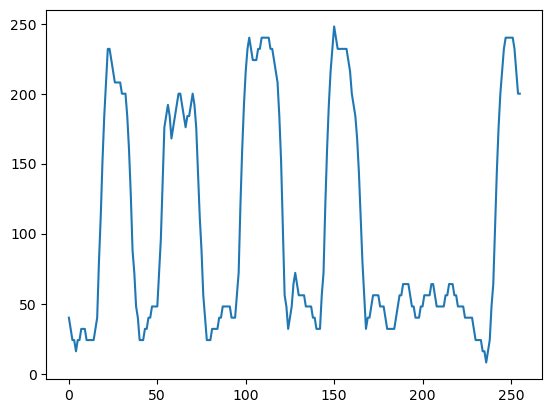
    


```python
plt.imshow(img)
```


    <matplotlib.image.AxesImage at 0x7fa9a8890b20>


    
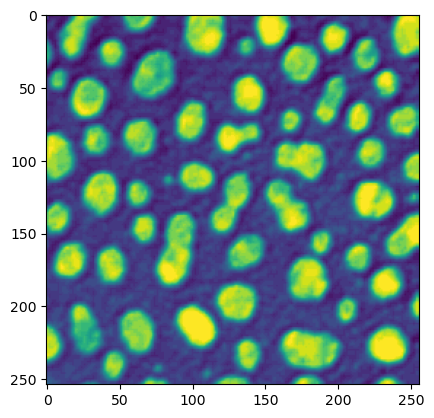
    


```python
plt.imshow(img, cmap='gray')
plt.colorbar()
```


    <matplotlib.colorbar.Colorbar at 0x7fa9ad682e20>


    
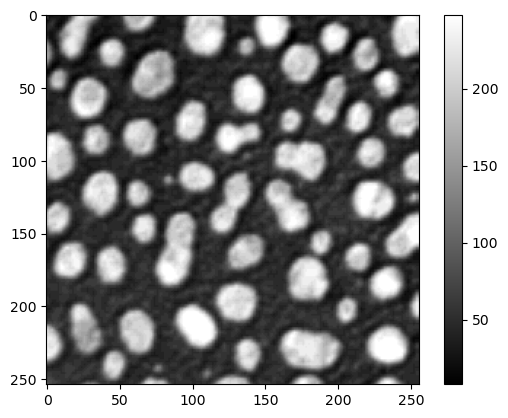
    


```python
plt.imshow(img, vmax=127, cmap='gray') #everything over 127 is white
```


    <matplotlib.image.AxesImage at 0x7fa9adaf4f40>


    
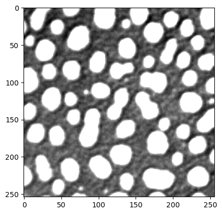
    


```python
plt.imshow(img, vmin=50, vmax=150, cmap='gray') #everything over 127 is white
```


    <matplotlib.image.AxesImage at 0x7fa9ad96c1f0>


    
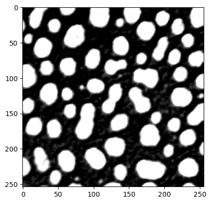
    


```python
img3=img.astype(float)
img3[128,128]=3000
plt.imshow(img3, cmap='gray', vmax=255)
```


    <matplotlib.image.AxesImage at 0x7fa9add51fd0>


    
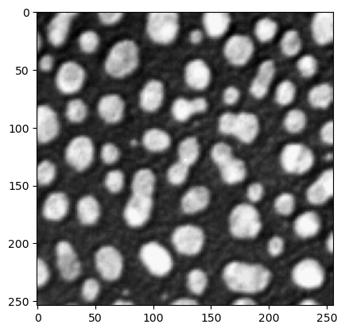
    


```python
plt.imshow(img, cmap='gray', vmin=127, vmax=128)
```


    <matplotlib.image.AxesImage at 0x7fa9ae462400>


    
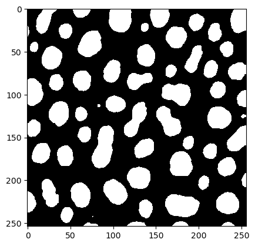
    


```python
df>128 #can you calculate pixel are using dataframes?
```


<div>
<style scoped>
    .dataframe tbody tr th:only-of-type {
        vertical-align: middle;
    }

    .dataframe tbody tr th {
        vertical-align: top;
    }

    .dataframe thead th {
        text-align: right;
    }
</style>
<table border="1" class="dataframe">
  <thead>
    <tr style="text-align: right;">
      <th></th>
      <th>0</th>
      <th>1</th>
      <th>2</th>
      <th>3</th>
      <th>4</th>
      <th>5</th>
      <th>6</th>
      <th>7</th>
      <th>8</th>
      <th>9</th>
      <th>...</th>
      <th>246</th>
      <th>247</th>
      <th>248</th>
      <th>249</th>
      <th>250</th>
      <th>251</th>
      <th>252</th>
      <th>253</th>
      <th>254</th>
      <th>255</th>
    </tr>
  </thead>
  <tbody>
    <tr>
      <th>0</th>
      <td>False</td>
      <td>False</td>
      <td>False</td>
      <td>False</td>
      <td>False</td>
      <td>False</td>
      <td>False</td>
      <td>False</td>
      <td>False</td>
      <td>False</td>
      <td>...</td>
      <td>True</td>
      <td>True</td>
      <td>True</td>
      <td>True</td>
      <td>True</td>
      <td>True</td>
      <td>True</td>
      <td>True</td>
      <td>True</td>
      <td>True</td>
    </tr>
    <tr>
      <th>1</th>
      <td>False</td>
      <td>False</td>
      <td>False</td>
      <td>False</td>
      <td>False</td>
      <td>False</td>
      <td>False</td>
      <td>False</td>
      <td>False</td>
      <td>False</td>
      <td>...</td>
      <td>True</td>
      <td>True</td>
      <td>True</td>
      <td>True</td>
      <td>True</td>
      <td>True</td>
      <td>True</td>
      <td>True</td>
      <td>True</td>
      <td>True</td>
    </tr>
    <tr>
      <th>2</th>
      <td>False</td>
      <td>False</td>
      <td>False</td>
      <td>False</td>
      <td>False</td>
      <td>False</td>
      <td>False</td>
      <td>False</td>
      <td>False</td>
      <td>False</td>
      <td>...</td>
      <td>True</td>
      <td>True</td>
      <td>True</td>
      <td>True</td>
      <td>True</td>
      <td>True</td>
      <td>True</td>
      <td>True</td>
      <td>True</td>
      <td>True</td>
    </tr>
    <tr>
      <th>3</th>
      <td>False</td>
      <td>False</td>
      <td>False</td>
      <td>False</td>
      <td>False</td>
      <td>False</td>
      <td>False</td>
      <td>False</td>
      <td>False</td>
      <td>False</td>
      <td>...</td>
      <td>True</td>
      <td>True</td>
      <td>True</td>
      <td>True</td>
      <td>True</td>
      <td>True</td>
      <td>True</td>
      <td>True</td>
      <td>True</td>
      <td>True</td>
    </tr>
    <tr>
      <th>4</th>
      <td>False</td>
      <td>False</td>
      <td>False</td>
      <td>False</td>
      <td>False</td>
      <td>False</td>
      <td>False</td>
      <td>False</td>
      <td>False</td>
      <td>False</td>
      <td>...</td>
      <td>True</td>
      <td>True</td>
      <td>True</td>
      <td>True</td>
      <td>True</td>
      <td>True</td>
      <td>True</td>
      <td>True</td>
      <td>True</td>
      <td>True</td>
    </tr>
    <tr>
      <th>...</th>
      <td>...</td>
      <td>...</td>
      <td>...</td>
      <td>...</td>
      <td>...</td>
      <td>...</td>
      <td>...</td>
      <td>...</td>
      <td>...</td>
      <td>...</td>
      <td>...</td>
      <td>...</td>
      <td>...</td>
      <td>...</td>
      <td>...</td>
      <td>...</td>
      <td>...</td>
      <td>...</td>
      <td>...</td>
      <td>...</td>
      <td>...</td>
    </tr>
    <tr>
      <th>249</th>
      <td>False</td>
      <td>False</td>
      <td>False</td>
      <td>False</td>
      <td>False</td>
      <td>False</td>
      <td>False</td>
      <td>False</td>
      <td>False</td>
      <td>False</td>
      <td>...</td>
      <td>False</td>
      <td>False</td>
      <td>False</td>
      <td>False</td>
      <td>False</td>
      <td>False</td>
      <td>False</td>
      <td>False</td>
      <td>False</td>
      <td>False</td>
    </tr>
    <tr>
      <th>250</th>
      <td>False</td>
      <td>False</td>
      <td>False</td>
      <td>False</td>
      <td>False</td>
      <td>False</td>
      <td>False</td>
      <td>False</td>
      <td>False</td>
      <td>False</td>
      <td>...</td>
      <td>False</td>
      <td>False</td>
      <td>False</td>
      <td>False</td>
      <td>False</td>
      <td>False</td>
      <td>False</td>
      <td>False</td>
      <td>False</td>
      <td>False</td>
    </tr>
    <tr>
      <th>251</th>
      <td>False</td>
      <td>False</td>
      <td>False</td>
      <td>False</td>
      <td>False</td>
      <td>False</td>
      <td>False</td>
      <td>False</td>
      <td>False</td>
      <td>False</td>
      <td>...</td>
      <td>False</td>
      <td>False</td>
      <td>False</td>
      <td>False</td>
      <td>False</td>
      <td>False</td>
      <td>False</td>
      <td>False</td>
      <td>False</td>
      <td>False</td>
    </tr>
    <tr>
      <th>252</th>
      <td>False</td>
      <td>False</td>
      <td>False</td>
      <td>False</td>
      <td>False</td>
      <td>False</td>
      <td>False</td>
      <td>False</td>
      <td>False</td>
      <td>False</td>
      <td>...</td>
      <td>False</td>
      <td>False</td>
      <td>False</td>
      <td>False</td>
      <td>False</td>
      <td>False</td>
      <td>False</td>
      <td>False</td>
      <td>False</td>
      <td>False</td>
    </tr>
    <tr>
      <th>253</th>
      <td>False</td>
      <td>False</td>
      <td>False</td>
      <td>False</td>
      <td>False</td>
      <td>False</td>
      <td>False</td>
      <td>False</td>
      <td>False</td>
      <td>False</td>
      <td>...</td>
      <td>False</td>
      <td>False</td>
      <td>False</td>
      <td>False</td>
      <td>False</td>
      <td>False</td>
      <td>False</td>
      <td>False</td>
      <td>False</td>
      <td>False</td>
    </tr>
  </tbody>
</table>
<p>254 rows × 256 columns</p>
</div>


```python
tfdf= df>128
tfdf.sum().sum()
```


    21413


```python
Image.open('FluorescentCells.tif')
```


    
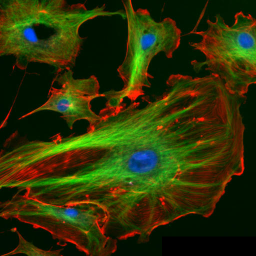
    


```python
cimg=tifffile.imread('FluorescentCells.tif')
cimg.shape
```


    (512, 512, 3)


```python
rimg=cimg[:,:,0]
rimg.shape
```


    (512, 512)


```python
plt.imshow(rimg, cmap='gray')
```


    <matplotlib.image.AxesImage at 0x7fa9ae707a90>


    
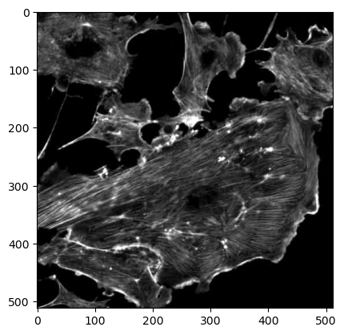
    


```python
cimg2=np.zeros(cimg.shape,dtype=np.uint8)
#set the red channel
cimg2[:,:,0]=cimg[:,:,0]
#set the blue channel
cimg2[:,:,2]=cimg[:,:,0]
#keep the green channel as it was
cimg2[:,:,1]=cimg[:,:,1]
plt.imshow(cimg2)
plt.show()
```


    
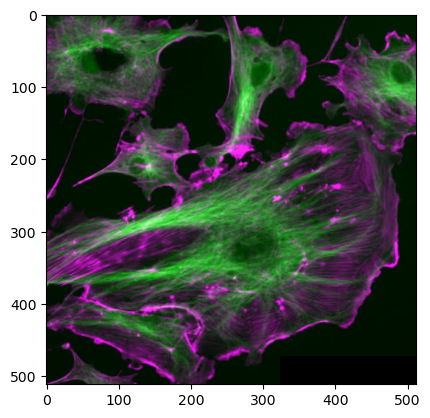
    


```python
cimg2=np.zeros(cimg.shape,dtype=np.uint8)
cimg2[:,:,0]=cimg[:,:,0]
cimg2[:,:,1]=cimg[:,:,0]
cimg2[:,:,2]=cimg[:,:,1]
plt.imshow(cimg2)
plt.show()
```


    
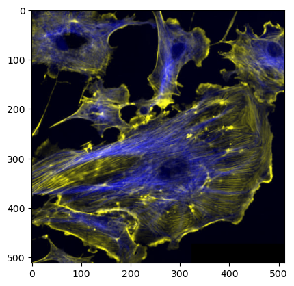
    


```python
cimg2=np.zeros(cimg.shape,dtype=np.uint8)
cimg2[:,:,0]=cimg[:,:,0]
cimg2[:,:,1]=cimg[:,:,0]+cimg[:,:,1]
cimg2[:,:,2]=cimg[:,:,1]
plt.imshow(cimg2)
plt.show()
```


    
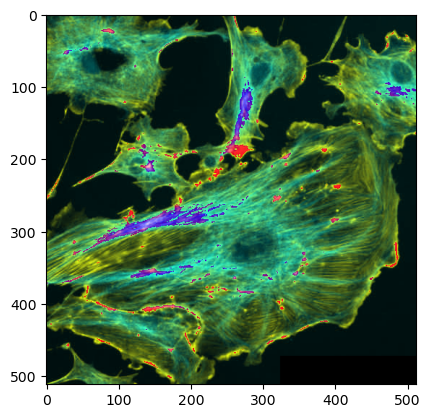
    


```python
plt,imshow(mask, cmap='gray')
```


    ---------------------------------------------------------------------------

    NameError                                 Traceback (most recent call last)

    Cell In[46], line 1
    ----> 1 plt,imshow(mask, cmap='gray')


    NameError: name 'imshow' is not defined


```python

```


```python

```


```python

```
